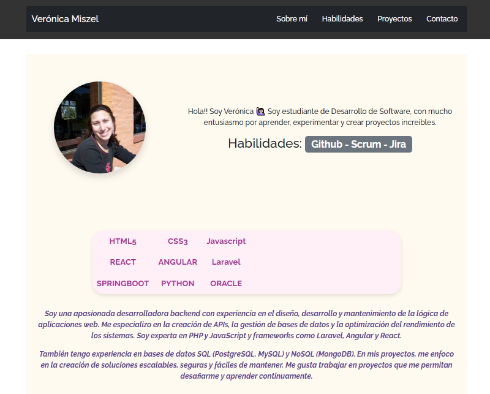
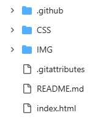

Portfolio principales sistemas.

Verónica Miszel

 

Portfolio Web - Verónica Miszel
Link https://veritomis.github.io/portfolio_VM/#proyectos

Este proyecto consiste en un sitio web de portfolio personal realizado como parte de la materia Frontend de la Tecnicatura Superior en Desarrollo de Software.

Objetivo

El objetivo es crear un sitio web responsive que presente información personal, habilidades, proyectos y un formulario de contacto, utilizando únicamente HTML, CSS y JavaScript puros (sin frameworks como Bootstrap).

Tecnologías utilizadas

- HTML5
- CSS3
- JavaScript (vanilla)

Funcionalidades

- Barra de navegación con enlaces ancla que permiten moverse entre secciones.
- Sección "Sobre mí" con una imagen y descripción personal.
- Listado de habilidades.
- Galería de proyectos.
- Formulario de contacto funcional (aunque no envía información, tiene validación básica de campos).
- Estilos aplicados con CSS puro, incluyendo efectos de hover.
- Diseño responsive para dispositivos móviles.

Responsividad

El diseño se adapta a diferentes tamaños de pantalla usando media queries. No se utilizó Bootstrap ni otro framework de CSS.

Estructura del proyecto

